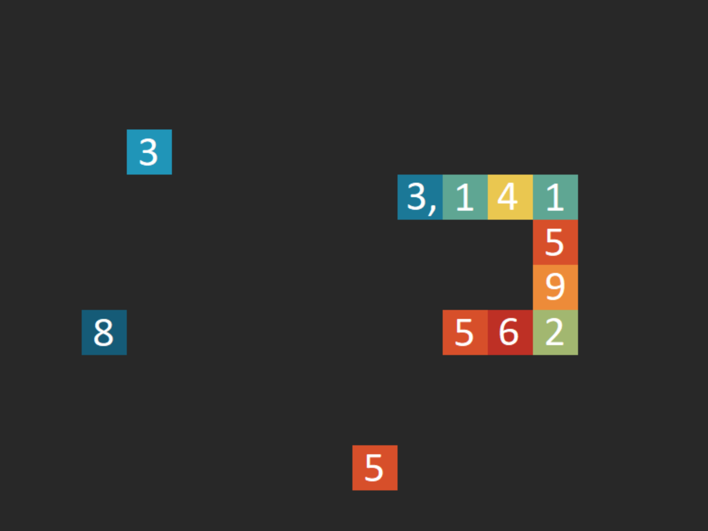

# Pithon
> Because Pi is a never ending snake!

## General info
This is a variation of the classic game - Snake. Here every new collected brick is another Pi dicimal expansion number. The game has two levels of difficulty. In an easy level you just collect bricks one by one. In a hard level there are displayed three different numbers and you have to choose the right one.

## Technologies
* C++11
* SDL 2.0

## Status
Project is _suspended_. It could be a music added in the next version.

## Inspiration
* Snake game
* Pi number
